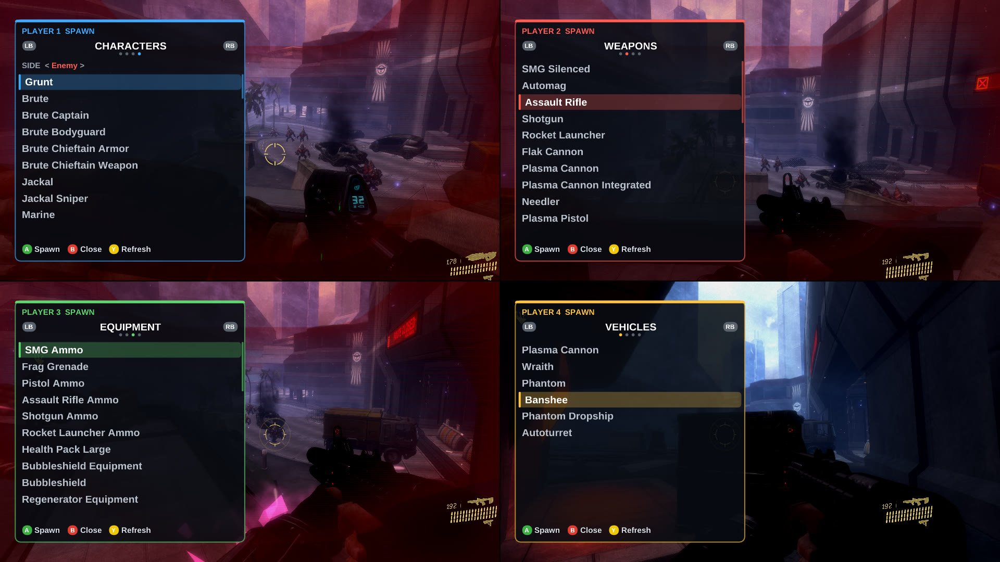
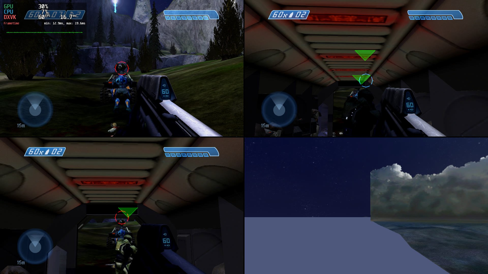
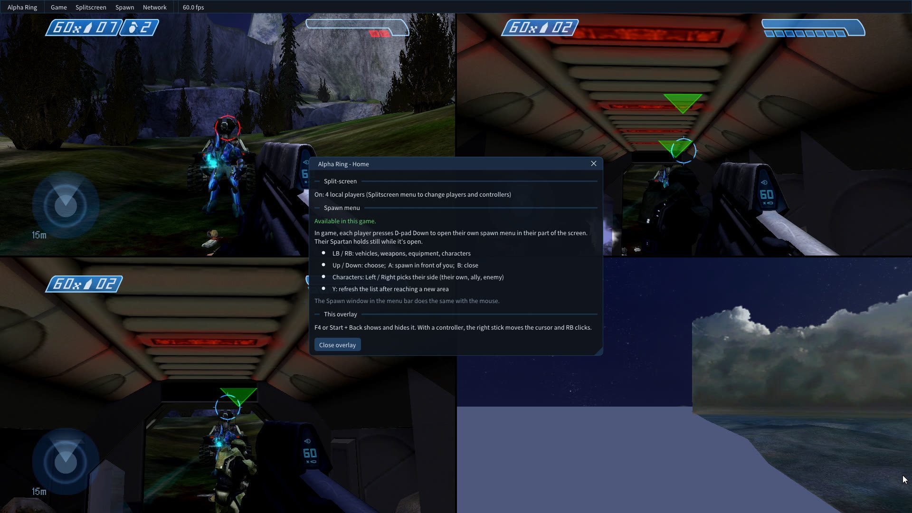
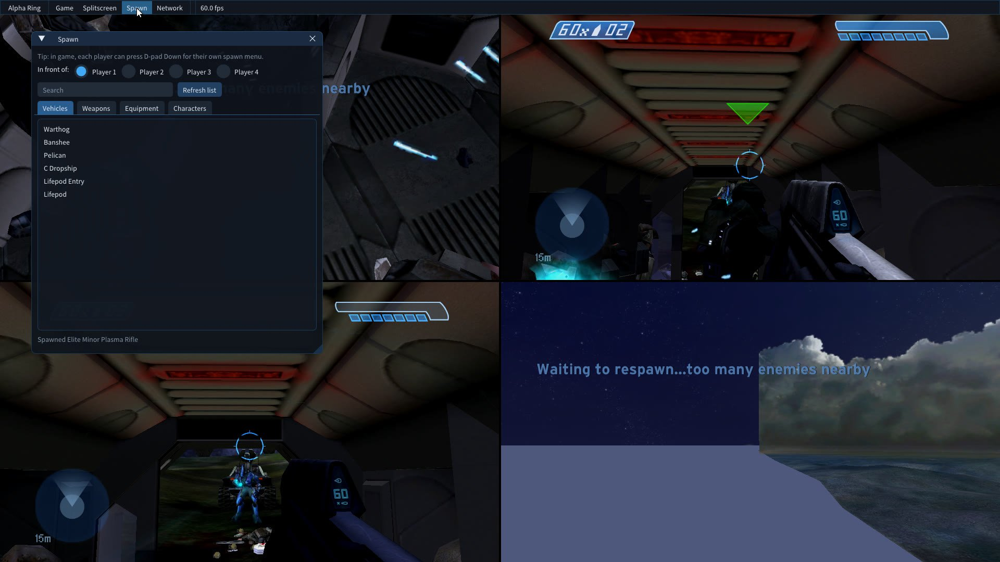

# AlphaRing - kirklandsig Fork

> **This is a personal fork of [thejackbitt/AlphaRing](https://github.com/thejackbitt/AlphaRing) for testing and development.**
>
> **Based on:** JackBitt's AlphaRing v1.2.1 (commit `bdad7eb`)
>
> For the original project, see [WinterSquire/AlphaRing](https://github.com/WinterSquire/AlphaRing)

---

## What's New in v1.5.0 (experimental)



> **Testing status:** so far this build has only been tested on **one Batocera Linux machine running the
> latest Batocera** (MCC 1.3528 on Steam through Proton, driven by four virtual Xbox 360 controllers). It needs
> a lot more testing on other machines and setups (Windows, Steam Deck, other Linux distros, real and
> different controllers) - expect bugs, and please report what you find in
> [Issues](https://github.com/kirklandsig/AlphaRing/issues).

### Spawn menu - Halo CE, Halo 2, Halo 3 and ODST campaigns
Spawn **vehicles, weapons, equipment and AI characters** in front of any player, in any mission.
Characters are real AI: pick **Enemy** and they attack you, **Ally** and they fight on your side,
or **their own side** (a Marine is friendly, an Elite hostile).

- **Every player gets their own menu.** In game, press **D-pad Down**: a menu opens in *your* part of the
  split screen and your controller drives it while your Spartan holds still. The other players keep playing
  (or open their own menus at the same time).
- The lists only show what the current area of the mission has loaded, so everything listed can spawn.
- There is also a **Spawn** window in the F4 overlay for mouse users.

| Button | In the spawn menu |
|--|--|
| D-pad Down | open the menu (configurable) |
| LB / RB | vehicles, weapons, equipment, characters |
| Up / Down (or left stick) | choose |
| A | spawn in front of you |
| Left / Right | characters: their own side, ally, enemy |
| Y | refresh the list after reaching a new area |
| B | close |



To change or turn off the spawn button, edit `alpha_ring_menu.cfg` next to the game exe:
```
spawn_menu_controller=DPAD_DOWN   # any button or combo like BACK+DPAD_DOWN, or NONE
```

How it works, briefly: objects are created with each engine's own `object_placement_data_new` + `object_new`.
For characters, Halo CE attaches a free actor to a spawned body (`ai_attach_free`); Halo 2, 3 and ODST have
no such function in their retail builds, so a spare spawn point of an empty squad in the loaded mission is
pointed at you and the chosen character, placed with the engine's own `ai_place`, and put back.

### 4-player split screen fixes
- **Halo 4 with 3-4 players no longer renders black**: the mission starts with two players and the others
  join a moment later, like controllers signing in mid-game.
- **Halo CE and Halo 2 Anniversary with 3-4 players**: the Anniversary renderer only draws two views, so these
  sessions start in Classic graphics (your MCC setting is left alone). For proper player 3/4 spawns use the
  Workshop mods *Halo CE 3/4 Player Co-Op Fixes* and *Halo 2 3/4 Player Co-Op Fixes*.
- **Hang when loading a second game in one session fixed**: MCC loads every game's DLL at the menu and later
  reloads them at new addresses; AlphaRing's hooks were never removed, so a stale one could be written into
  another game's code (seen as Halo 3 freezing on its second load). Hooks are now removed when a DLL unloads.
- **Boot hang under Proton fixed**: the overlay no longer starts open and only swallows the mouse/keyboard
  input it actually uses.

### Overlay
- New look (dark theme, bigger readable fonts that also exist under Proton) and a **Home** panel that
  explains split screen, the spawn menu and the overlay controls the first time you open it.

| | |
|--|--|
|  |  |

### Known limitations
- Only MCC **1.3528.0.0** (Steam). Campaign only.
- Spawned characters borrow a spare squad of the mission. In rare cases a mission script may wait on that
  squad; if a mission stops progressing, kill the characters you spawned.
- Spawned allies fight but don't follow you around.
- The game keeps running while a spawn menu is open, so find cover first.
- Halo 2 with the co-op mod and 2+ players: Save & Quit can hang on the loading screen (progress is saved).
- Three-player layouts are assumed to be quarters; please report if a menu shows up in the wrong place.

---

## Earlier additions in this fork

#### 1. Controller-to-Player Binding (Splitscreen)
- Each player now has a **"Bind" button** next to the controller dropdown
- Click "Bind" → Press any button on a controller → Automatically assigns that controller to the player
- No more guessing which controller is "Controller 1" vs "Controller 2"

#### 2. Button-to-Action Binding (Gamepad Mapping)
- Each action in the Gamepad Mapping section has a **"Bind" button**
- Click "Bind" → Press a button → That button is assigned to the action

#### 3. Fixed Default Gamepad Mappings
- **Bug fixed:** Previously, all actions defaulted to "Left Trigger" due to uninitialized memory
- **Now:** New profiles initialize with standard Xbox Halo controls:

| Action | Button |
|--------|--------|
| Jump | A |
| Melee | B |
| Action/Interact | X |
| Change Weapon | Y |
| Reload | RB |
| Switch Grenades | LB |
| Shoot | RT |
| Throw Grenade | LT |
| Flashlight | D-pad Up |
| Crouch | Left Stick Click |
| Zoom | Right Stick Click |

---

## Original Alpha Ring

A Modding Tool for MCC

[](https://ci.appveyor.com/project/WinterSquire/alpharing)
[](https://discord.gg/TUyAnCrpuz)

### Showcase

| | |
|--|--|
| Camera Tool (H3) <br>  | Object Browser (H3) <br>  |
| 8 Players Campaign <br>  | Splitscreen With [Mod](https://steamcommunity.com/sharedfiles/filedetails/?id=3153235187) (By [Priception](https://steamcommunity.com/id/priception)) <br>  |

### Features
* Splitscreen (all games)
* Camera Tool (H3)
* Object Browser (H3)

### Installation
Make sure you have the latest [Microsoft Visual C++ Redistributable](https://aka.ms/vs/17/release/vc_redist.x64.exe) installed.

Download the latest stable build from the [Releases](https://github.com/kirklandsig/AlphaRing/releases) page.

Place the DLL into the "Halo The Master Chief Collection\mcc\binaries\win64" directory and launch the game with EAC off.

For Running on Steam Deck/Linux, add the following command in the Steam Game Launch Options:
```
WINEDLLOVERRIDES="WTSAPI32=n,b" %command%
```

#### Batocera Linux

For Batocera Linux users, additional setup is required:

1. **Download Proton GE**: Get the latest `tar.gz` from the [Proton GE releases page](https://github.com/GloriousEggroll/proton-ge-custom/releases) (Proton GE 10-15 or newer recommended)

2. **Install Proton GE**: Unpack the archive to your Steam compatibility tools folder:
   ```
   ~/.steam/root/compatibilitytools.d/
   ```

3. **Restart Steam**: Close and reopen the Steam client for it to detect the new Proton version

4. **Configure the game**:
   - Right-click MCC → Properties → Compatibility
   - Enable "Force the use of a specific Steam Play compatibility tool"
   - Select **Proton GE 10-15** (or your installed version)

5. **Set launch options**: Add the following to Steam Launch Options:
   ```
   WINEDLLOVERRIDES="WTSAPI32=n,b" %command%
   ```

6. **Controller Setup (Important for non-Xbox controllers)**:
   - For 8BitDo and other third-party controllers, enable **Steam Input** for the controller
   - Go to Steam → Settings → Controller → Enable "Xbox Configuration Support"
   - This allows Steam to translate your controller inputs to XInput, which MCC and AlphaRing expect
   - Without this, some buttons (like A or stick clicks) may not be detected

> **Note:** The unofficial Batocera add-ons version of the Steam client has been tested and works with this setup.

### Usage
Toggle menu: `F4` or `Controller Back` + `Controller Start`

To navigate using Controller use the `Right Stick` to move the mouse and `RB` to click.

When the menu is open, game input is disabled.

Spawn menu: in a campaign mission of Halo CE, Halo 2, Halo 3 or ODST, each player presses `D-pad Down`
(see [What's New](#whats-new-in-v150-experimental)).

---

## Building from Source

### Prerequisites
- Visual Studio 2022 Build Tools
- CMake 3.27+

### Build Commands
```bash
# First time setup
mkdir build && cd build
cmake .. -G "Visual Studio 17 2022" -A x64

# Build
"C:/Program Files (x86)/Microsoft Visual Studio/2022/BuildTools/MSBuild/Current/Bin/MSBuild.exe" WTSAPI32.vcxproj -p:Configuration=Release -p:Platform=x64
```

Output: `build/Release/WTSAPI32.dll`

---

## Credits
- **Original AlphaRing:** [WinterSquire](https://github.com/WinterSquire/AlphaRing)
- **Profile Tweaks Fork:** [thejackbitt](https://github.com/thejackbitt/AlphaRing)
- **This Fork:** kirklandsig (controller binding, spawn menus, split-screen fixes)
- [megabitt01 / thejackbitt](https://github.com/megabitt01/AlphaRing) for the configurable menu hotkeys.
- Research references for the spawn system: [Assembly](https://github.com/XboxChaos/Assembly) plugins
  (scenario layouts), [c20](https://c20.reclaimers.net) (HaloScript), and the ManagedDonkey, ElDorito and
  Project Cartographer projects.
- [Assembly](https://github.com/XboxChaos/Assembly) for the tag group research.
- [Blender](https://github.com/blender/blender) for the bezier curve calculation.
- [Priception](https://github.com/Priception) for adding UI controller support and helping with the interface and crash issue.
