# AlphaRing - kirklandsig Fork

> **This is a personal fork of [thejackbitt/AlphaRing](https://github.com/thejackbitt/AlphaRing) for testing and development.**
>
> **Based on:** JackBitt's AlphaRing v1.2.1 (commit `bdad7eb`)
>
> For the original project, see [WinterSquire/AlphaRing](https://github.com/WinterSquire/AlphaRing)

---

## What's New in v1.7.0 (experimental)

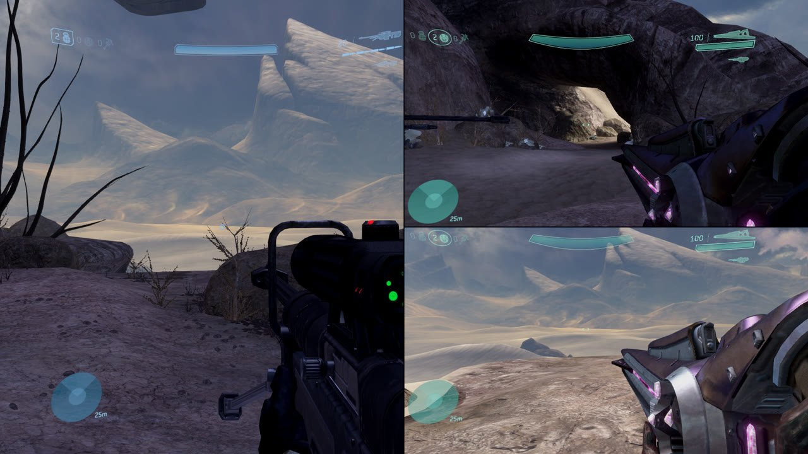

> **Testing status:** like v1.6.0, this build has only been tested on **one Batocera Linux machine running the
> latest Batocera** (MCC 1.3528 on Steam through Proton, virtual Xbox 360 controllers, 1920x1080). It needs a lot
> more testing on other machines and setups - expect bugs, and please report what you find in
> [Issues](https://github.com/kirklandsig/AlphaRing/issues).

### Side-by-side (Left/Right) split screen in every game
XiaoDanny's Left/Right split for Halo Reach now works in **Halo CE, Halo 2, Halo 3 and ODST** as well, with
**Halo 4 as a work in progress** - one setting for all the games:

- **2 players:** two full-height halves. **3 players:** player 1 on the left half, players 2 and 3 on the right.
- **Switch it:** press **D-pad Down**, go to the **MY HUD** page (**SCREEN** in Halo 4) and change **SPLIT** with the
  D-pad - or overlay → **Splitscreen → Options → Side-by-side split**. It's saved, and applies to everyone. Halo 3,
  ODST, Halo 4 and Reach switch on the spot; Halo CE and Halo 2 switch when a mission starts or restarts.
- The views aren't stretched: each half is drawn at its real size.
- Each player's HUD stays in their own half. In Halo 3 and ODST a half uses the quarter-screen HUD, made as tall as
  the half, so the motion tracker sits at the bottom; Halo 2 and CE lay their HUD out for each view themselves.
- Halo 2 and CE use Classic graphics side by side (their Anniversary renderer only draws stacked views).
- Crosshairs sit in the middle of each half in Halo 2, CE and Halo 4. Halo 3 and ODST nudge each view's centre,
  and the crosshair and aim with it, toward the middle of the screen, as they do in their own 4-player split.

| | |
|--|--|
| 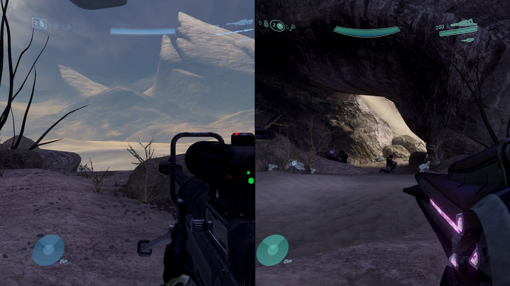 | 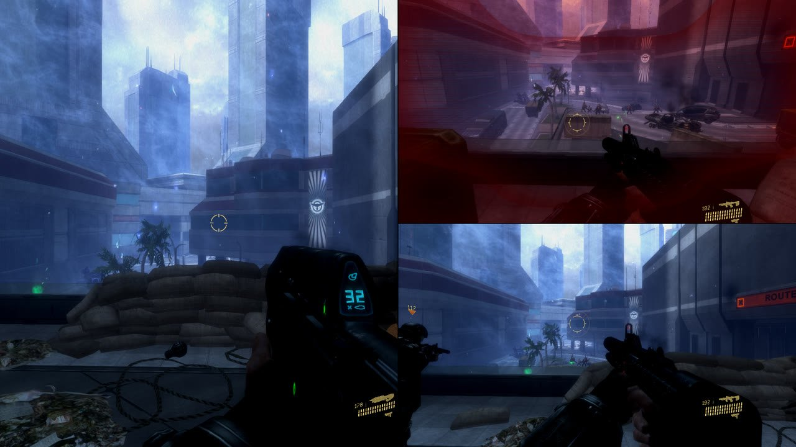 |
| 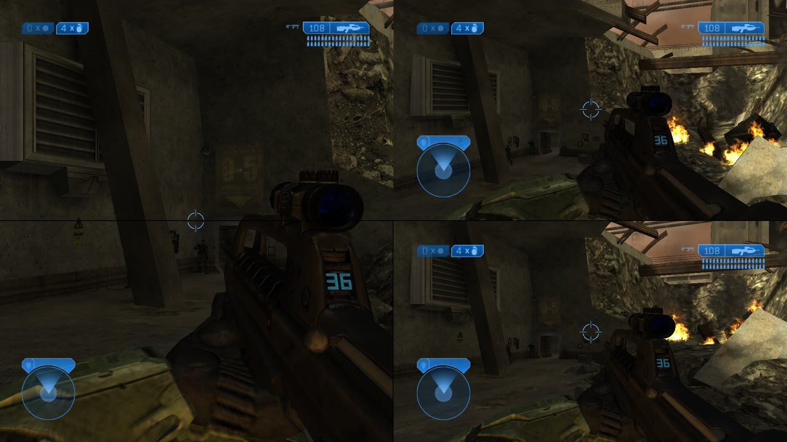 | 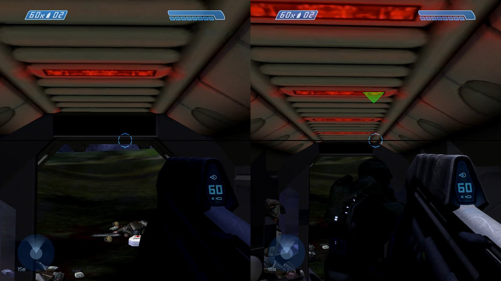 |

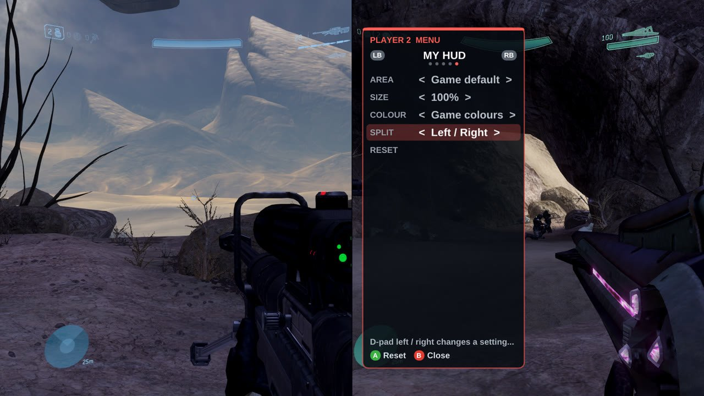

### Fixes
- **Dual wielding for players 2-4 with controls saved by older versions:** mappings saved before v1.6.0 (and custom
  mapping profiles) had no button for *Use Left Weapon*, *Swap/Reload Left Weapon* or the vehicle functions, so
  players 2-4 still couldn't dual wield after updating. They now get their usual buttons when such a mapping loads.
  Rebinding *Reload*, *Throw Grenade*, *Crouch* or *Jump* also moves the actions that share its button (as in
  MegaBit's fork), unless you bound those separately.
- The per-player menu now opens in Halo 4 too (for the SPLIT setting).

### Known limitations
- **Halo 4 side by side is a work in progress:** the views, aim and switching work, but Halo 4 keeps its two-player
  HUD layout - the lower HUD elements sit mid-height and the top-right weapon panel is cut off at the edge of the
  half. Not tested with 3 players yet.
- **Halo 2 and CE side by side:** the stock divider line is still drawn straight across the middle of the screen.
- Halo CE keeps its own 3-player layout.
- Halo 2 and CE: switching to Anniversary graphics in the middle of a side-by-side mission isn't supported.

---

## What's New in v1.6.0 (experimental)

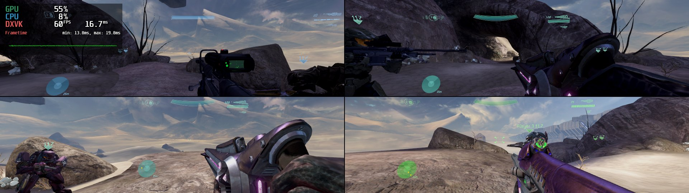

> **Testing status:** like v1.5.0, this build has only been tested on **one Batocera Linux machine running the
> latest Batocera** (MCC 1.3528 on Steam through Proton, four virtual Xbox 360 controllers, a 32:9 window for the
> ultrawide tests). It needs a lot more testing on other machines and setups (Windows, Steam Deck, real
> ultrawide and multi-monitor setups, different controllers) - expect bugs, and please report what you find in
> [Issues](https://github.com/kirklandsig/AlphaRing/issues).

### Your own HUD, per player - Halo CE, 2, 3, ODST and Reach
Every player can lay out, resize, hide and recolour their own HUD, and pick a **HUD area** for their screen.

- **HUD area presets** - *Game default*, *Screen edges*, *21:9 box*, *16:9 box* or *4:3 box*: the HUD is laid out
  in a centered box of that shape inside the player's view. Pull it in from the far edges of an ultrawide or
  multi-monitor view, or spread Halo CE's HUD (always a centered 4:3 box) out to the edges of the screen.
- **Each element** - motion tracker, shield/health, weapon/ammo, grenades, crosshair (size/hide), equipment and
  messages: move left/right/up/down, resize or hide.
- **Colour** (Halo 3, ODST, Reach): shift the HUD toward any hue; enemy reds and whites keep their colour.
- **From the controller:** press **D-pad Down**, then **LB/RB** to the **MY HUD** page - area, size and colour with
  the D-pad, **A** on Reset to start over. In Halo Reach, D-pad Down opens straight on this page.
- **With the mouse:** overlay (F4) → **HUD** window, one tab per player. Everything is saved to `alpha_ring_hud.cfg`.

| | |
|--|--|
| 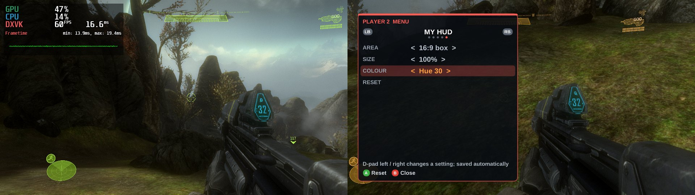 | 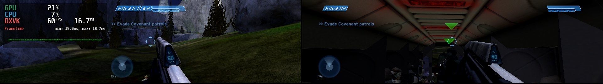 |

### Ultrawide / multi-monitor: Halo 2 HUD bunching fixed
With MCC's *HUD anchor: Centered* (the default) on a screen wider than 16:9, Halo 2 squeezed every player's HUD
into a 16:9 box in the middle of the **whole screen**: HUDs bunched toward the center and crosshairs off-center.
Halo 2 now keeps each player's HUD at the edges of their own view (Dev Tools → halo2 → *HUD at screen edges*,
on by default).

| Before (4 players on 32:9, top row) | After |
|--|--|
| 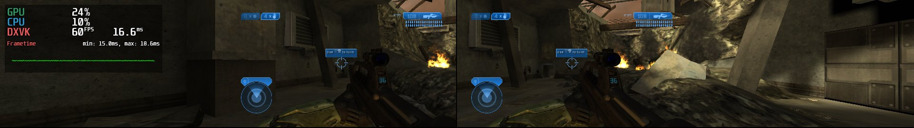 | 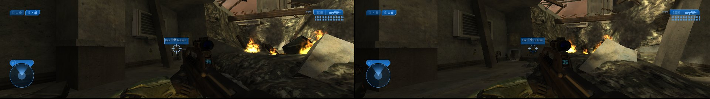 |

### Halo Reach vertical split screen - by XiaoDanny
[XiaoDanny (Daniel Coyle)](https://github.com/XiaoDanny)'s Reach work from
[megabitt01/AlphaRing #17 and #20](https://github.com/megabitt01/AlphaRing/pull/20) is now part of this fork, with
full credit - his code, comments and research notes ([`docs/REVERSE_ENGINEERING.md`](docs/REVERSE_ENGINEERING.md))
are kept as he wrote them:

- **Left/Right split** for 2 players (two full-height halves) and 3 players (player 1 on the left half, players 2
  and 3 on the right) - made for ultrawide and two-monitor setups.
- **Per-player FOV** in split screen (Reach normally forces 78 degrees on everyone).
- **Splitscreen Render Quality** option: split screen normally drops grass, grenade glow, decals and dynamic
  lights; this restores the 1-player detail level (costs frame rate at 3-4 players).
- The **Reach loadout screen** is no longer invisible in 2-3 player Firefight/customs, and Reach's menus are no
  longer stretched at 32:9.
- Everything is in the overlay's **Game → Dev Tools** window (layout, FOV sliders, black bars, render quality,
  the Splitscreen Config Editor) and is saved.

| | |
|--|--|
| 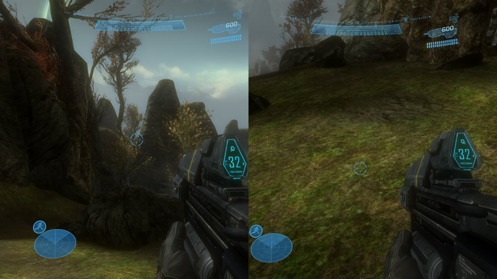 | 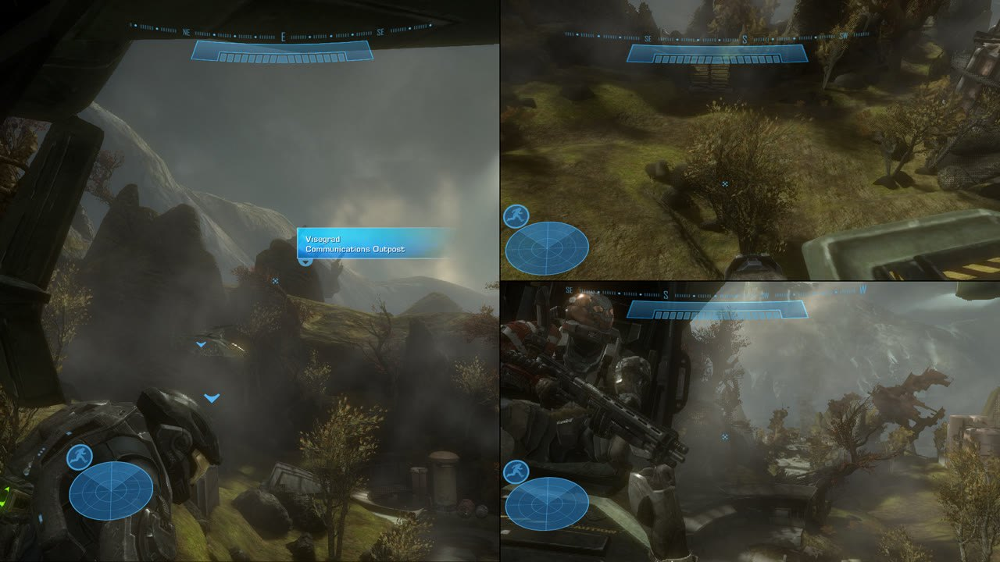 |

### AI spawn with weapons - pick one for each spawn
- Spawned AI now carry the weapon the mission gives that character. (Halo 3's AI used to spawn unarmed and could
  only melee.) Halo 3's Marines get Battle Rifles and its Brutes Spikers, for example.
- **Choose the weapon** for every spawn: on the Characters page press **LT / RT** to go through the weapons the
  level has loaded, or back to *Their usual weapon*. In the overlay's Spawn window, use the *Weapon* list.
  Works in Halo CE, Halo 2, Halo 3 and ODST.

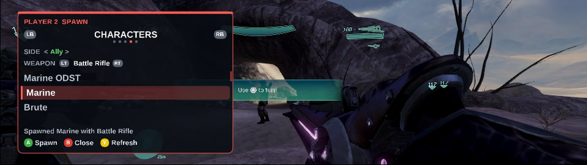

| Button (Characters page) | |
|--|--|
| LT / RT | the character's weapon |
| Left / Right | their own side, ally, enemy |

### Fixes
- **Players 2-4 started with empty settings** (no sound, FOV and look sensitivity at their minimum, HUD scale 0)
  unless you had saved profiles for them. They now start with player 1's MCC settings.
- **Look sensitivity** in the profile editor is a 1-10 value again (it was saved as on/off, which made players 2-4
  turn slowly) - the field fix is MegaBit's, from his fork.
- **Dual wielding and vehicle boost for players 2-4:** the default controls now bind Use/Reload Left Weapon and the
  vehicle functions the way MCC does (defaults from MegaBit's fork).
- **Halo CE level-end freeze (attempted fix):** while a Halo CE map loads, every controller slot now answers the way
  it does with the overlay open - the known workaround for the freeze between missions. *Not yet confirmed: please
  report whether Halo CE still freezes after finishing a level.*
- Dev Tools patch settings are now actually restored on launch, and turning a default-on patch off really turns it
  off.
- An unsupported MCC version now leaves the game unmodified instead of hooking the wrong code.
- Proton: no console window (it could take focus and close MCC), XInput is loaded if MCC hasn't loaded it yet, the
  overlay scales with the screen (it was tiny on 4K TVs), and a build setting for older Proton runtimes.
- Per-player menus open in the right place with 3 players and in Reach's Left/Right split; the overlay no longer
  queues mouse/keyboard input while it's hidden.

### Known limitations
- Only MCC **1.3528.0.0** (Steam). Campaign only. No spawning in Halo Reach and Halo 4 (HUD pages work in Reach).
- HUD area presets move the HUD elements listed above (tracker, shield, weapon, grenades, equipment, messages);
  objective text, damage indicators and waypoints stay where the game puts them.
- Players 3/4 can spawn outside the map on some Halo CE/Halo 2 levels (the games were made for 2): use the Workshop
  co-op fix mods.

---

## What's New in v1.5.0 (experimental)


> **Testing status:** so far this build has only been tested on **one Batocera Linux machine running the
> latest Batocera** (MCC 1.3528 on Steam through Proton, driven by four virtual Xbox 360 controllers). It needs
> a lot more testing on other machines and setups (Windows, Steam Deck, other Linux distros, real and
> different controllers) - expect bugs, and please report what you find in
> [Issues](https://github.com/kirklandsig/AlphaRing/issues).

### Spawn menu - Halo CE, Halo 2, Halo 3 and ODST campaigns
Spawn **vehicles, weapons, equipment and AI characters** in front of any player, in any mission.
Characters are real AI: pick **Enemy** and they attack you, **Ally** and they fight on your side,
or **their own side** (a Marine is friendly, an Elite hostile).

- **Every player gets their own menu.** In game, press **D-pad Down**: a menu opens in *your* part of the
  split screen and your controller drives it while your Spartan holds still. The other players keep playing
  (or open their own menus at the same time).
- The lists only show what the current area of the mission has loaded, so everything listed can spawn.
- There is also a **Spawn** window in the F4 overlay for mouse users.

| Button | In the spawn menu |
|--|--|
| D-pad Down | open the menu (configurable) |
| LB / RB | vehicles, weapons, equipment, characters |
| Up / Down (or left stick) | choose |
| A | spawn in front of you |
| Left / Right | characters: their own side, ally, enemy |
| Y | refresh the list after reaching a new area |
| B | close |


To change or turn off the spawn button, edit `alpha_ring_menu.cfg` next to the game exe:
```
spawn_menu_controller=DPAD_DOWN   # any button or combo like BACK+DPAD_DOWN, or NONE
```

How it works, briefly: objects are created with each engine's own `object_placement_data_new` + `object_new`.
For characters, Halo CE attaches a free actor to a spawned body (`ai_attach_free`); Halo 2, 3 and ODST have
no such function in their retail builds, so a spare spawn point of an empty squad in the loaded mission is
pointed at you and the chosen character, placed with the engine's own `ai_place`, and put back.

### 4-player split screen fixes
- **Halo 4 with 3-4 players no longer renders black**: the mission starts with two players and the others
  join a moment later, like controllers signing in mid-game.
- **Halo CE and Halo 2 Anniversary with 3-4 players**: the Anniversary renderer only draws two views, so these
  sessions start in Classic graphics (your MCC setting is left alone). For proper player 3/4 spawns use the
  Workshop mods *Halo CE 3/4 Player Co-Op Fixes* and *Halo 2 3/4 Player Co-Op Fixes*.
- **Hang when loading a second game in one session fixed**: MCC loads every game's DLL at the menu and later
  reloads them at new addresses; AlphaRing's hooks were never removed, so a stale one could be written into
  another game's code (seen as Halo 3 freezing on its second load). Hooks are now removed when a DLL unloads.
- **Boot hang under Proton fixed**: the overlay no longer starts open and only swallows the mouse/keyboard
  input it actually uses.

### Overlay
- New look (dark theme, bigger readable fonts that also exist under Proton) and a **Home** panel that
  explains split screen, the spawn menu and the overlay controls the first time you open it.

| | |
|--|--|
|  |  |

### Known limitations
- Only MCC **1.3528.0.0** (Steam). Campaign only.
- Spawned characters borrow a spare squad of the mission. In rare cases a mission script may wait on that
  squad; if a mission stops progressing, kill the characters you spawned.
- Spawned allies fight but don't follow you around.
- The game keeps running while a spawn menu is open, so find cover first.
- Halo 2 with the co-op mod and 2+ players: Save & Quit can hang on the loading screen (progress is saved).

---

## Earlier additions in this fork

#### 1. Controller-to-Player Binding (Splitscreen)
- Each player now has a **"Bind" button** next to the controller dropdown
- Click "Bind" → Press any button on a controller → Automatically assigns that controller to the player
- No more guessing which controller is "Controller 1" vs "Controller 2"

#### 2. Button-to-Action Binding (Gamepad Mapping)
- Each action in the Gamepad Mapping section has a **"Bind" button**
- Click "Bind" → Press a button → That button is assigned to the action

#### 3. Fixed Default Gamepad Mappings
- **Bug fixed:** Previously, all actions defaulted to "Left Trigger" due to uninitialized memory
- **Now:** New profiles initialize with standard Xbox Halo controls:

| Action | Button |
|--------|--------|
| Jump | A |
| Melee | B |
| Action/Interact | X |
| Change Weapon | Y |
| Reload | RB |
| Switch Grenades | LB |
| Shoot | RT |
| Throw Grenade | LT |
| Flashlight | D-pad Up |
| Crouch | Left Stick Click |
| Zoom | Right Stick Click |

---

## Original Alpha Ring

A Modding Tool for MCC

[](https://ci.appveyor.com/project/WinterSquire/alpharing)
[](https://discord.gg/TUyAnCrpuz)

### Showcase

| | |
|--|--|
| Camera Tool (H3) <br>  | Object Browser (H3) <br>  |
| 8 Players Campaign <br>  | Splitscreen With [Mod](https://steamcommunity.com/sharedfiles/filedetails/?id=3153235187) (By [Priception](https://steamcommunity.com/id/priception)) <br>  |

### Features
* Splitscreen (all games)
* Camera Tool (H3)
* Object Browser (H3)

### Installation
Make sure you have the latest [Microsoft Visual C++ Redistributable](https://aka.ms/vs/17/release/vc_redist.x64.exe) installed.

Download the latest stable build from the [Releases](https://github.com/kirklandsig/AlphaRing/releases) page.

Place the DLL into the "Halo The Master Chief Collection\mcc\binaries\win64" directory and launch the game with EAC off.

For Running on Steam Deck/Linux, add the following command in the Steam Game Launch Options:
```
WINEDLLOVERRIDES="WTSAPI32=n,b" %command%
```

#### Batocera Linux

For Batocera Linux users, additional setup is required:

1. **Download Proton GE**: Get the latest `tar.gz` from the [Proton GE releases page](https://github.com/GloriousEggroll/proton-ge-custom/releases) (Proton GE 10-15 or newer recommended)

2. **Install Proton GE**: Unpack the archive to your Steam compatibility tools folder:
   ```
   ~/.steam/root/compatibilitytools.d/
   ```

3. **Restart Steam**: Close and reopen the Steam client for it to detect the new Proton version

4. **Configure the game**:
   - Right-click MCC → Properties → Compatibility
   - Enable "Force the use of a specific Steam Play compatibility tool"
   - Select **Proton GE 10-15** (or your installed version)

5. **Set launch options**: Add the following to Steam Launch Options:
   ```
   WINEDLLOVERRIDES="WTSAPI32=n,b" %command%
   ```

6. **Controller Setup (Important for non-Xbox controllers)**:
   - For 8BitDo and other third-party controllers, enable **Steam Input** for the controller
   - Go to Steam → Settings → Controller → Enable "Xbox Configuration Support"
   - This allows Steam to translate your controller inputs to XInput, which MCC and AlphaRing expect
   - Without this, some buttons (like A or stick clicks) may not be detected

> **Note:** The unofficial Batocera add-ons version of the Steam client has been tested and works with this setup.

### Usage
Toggle menu: `F4` or `Controller Back` + `Controller Start`

To navigate using Controller use the `Right Stick` to move the mouse and `RB` to click.

When the menu is open, game input is disabled.

Spawn menu: in a campaign mission of Halo CE, Halo 2, Halo 3 or ODST, each player presses `D-pad Down`
(see [What's New](#whats-new-in-v150-experimental)).

---

## Building from Source

### Prerequisites
- Visual Studio 2022 Build Tools
- CMake 3.27+

### Build Commands
```bash
# First time setup
mkdir build && cd build
cmake .. -G "Visual Studio 17 2022" -A x64

# Build
"C:/Program Files (x86)/Microsoft Visual Studio/2022/BuildTools/MSBuild/Current/Bin/MSBuild.exe" WTSAPI32.vcxproj -p:Configuration=Release -p:Platform=x64
```

Output: `build/Release/WTSAPI32.dll`

---

## Credits
- **Original AlphaRing:** [WinterSquire](https://github.com/WinterSquire/AlphaRing)
- **Profile Tweaks Fork:** [thejackbitt](https://github.com/thejackbitt/AlphaRing)
- **This Fork:** kirklandsig (controller binding, spawn menus, split-screen fixes)
- [megabitt01 / thejackbitt](https://github.com/megabitt01/AlphaRing) for the configurable menu hotkeys, the
  look-sensitivity field fix and the dual-wield/vehicle control defaults.
- [XiaoDanny (Daniel Coyle)](https://github.com/XiaoDanny) for Halo Reach vertical (Left/Right) split-screen,
  per-player split-screen FOV, split-screen render quality, per-player black-bar removal, the Reach loadout fix,
  Reach menu scaling at 32:9, persistent Dev Tools settings and the Splitscreen Config Editor
  ([megabitt01/AlphaRing#17](https://github.com/megabitt01/AlphaRing/pull/17),
  [#20](https://github.com/megabitt01/AlphaRing/pull/20)) - ported into this fork with his research notes in
  [`docs/REVERSE_ENGINEERING.md`](docs/REVERSE_ENGINEERING.md). The side-by-side split for the other games (v1.7.0)
  follows the path his Reach work mapped out.
- Research references for the spawn system: [Assembly](https://github.com/XboxChaos/Assembly) plugins
  (scenario layouts), [c20](https://c20.reclaimers.net) (HaloScript), and the ManagedDonkey, ElDorito and
  Project Cartographer projects.
- [Assembly](https://github.com/XboxChaos/Assembly) for the tag group research.
- [Blender](https://github.com/blender/blender) for the bezier curve calculation.
- [Priception](https://github.com/Priception) for adding UI controller support and helping with the interface and crash issue.
